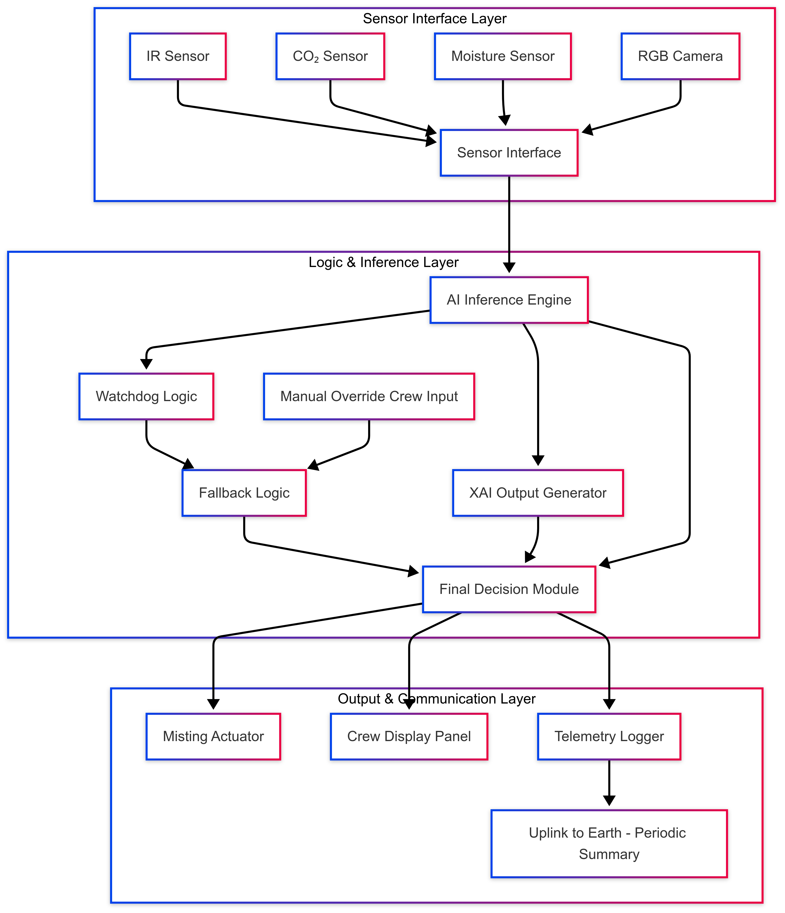

# Autonomous, Low-Power AI System for Plant Health Monitoring in Space and Resilient Agriculture

This repository documents a senior capstone project submitted to the NASA EPSCoR ISS Flight Opportunity. The system monitors plant health aboard the International Space Station using a fault-tolerant, low-power AI framework that integrates sensor fusion, Verilog-based logic, and explainable AI. It also supports dual-use applications in climate-resilient, off-grid agriculture in Hawai‘i.

## Project Goals

- Monitor plant stress in microgravity using thermal, moisture, CO₂, humidity, and RGB data.
- Execute AI inference and sensor fusion with onboard, low-power components.
- Provide logic-based fallback, override, and safety mechanisms (e.g., watchdog, TMR).
- Operate within ISS constraints: low crew time, low power (<3W), 3U volume.
- Transition to radiation-hardened FPGA systems post-prototype (e.g., Xilinx XQRKU060).

## System Architecture Overview

This block diagram shows the full autonomous pipeline for the plant health monitoring system, including sensor inputs, onboard AI logic, safety controls, and responsive outputs.

# System Requirements

Clearly defined requirements guiding FPGA logic, sensor integration, and AI inference validation.

---

## Sensor Input Requirements

### RGB Camera

- Resolution: (e.g., 640x480)
- Frame Rate: (e.g., 1 FPS minimum)
- Data format: RGB24 image stream

### Thermal IR Sensor

- Temperature Range: (e.g., -20°C to 100°C)
- Resolution: ±0.5°C accuracy

### Hyperspectral Sensor

- Spectral Bands: (define required bands clearly, e.g., 400nm–1000nm)
- Resolution and data rate: (specify clearly)

### Environmental Sensors

- **Moisture Sensor:** Capacitive, digital output, accuracy ±2%
- **CO₂ Sensor:** Measurement range (400–5000 ppm), accuracy ±30 ppm
- **Humidity/Temperature Sensor:** ±2% RH accuracy, ±0.5°C temperature accuracy

---

## Watchdog and Safety Logic Requirements

- Heartbeat frequency: (e.g., 1 Hz)
- Timeout thresholds: (e.g., watchdog reset trigger after 10 sec without heartbeat)
- Error handling policies clearly defined (halt system, reset sensors, etc.)

---

## AI Model Requirements

### Inference Model

- **Model Type:** MobileNet, MLP
- **Input Types:** Multimodal (RGB images, sensor data)
- **Quantization:** INT8 or lower precision (Brevitas/FINN workflow)
- **Accuracy Targets:** ≥ 90% precision/recall for stress detection

### Performance Constraints

- **Latency Target:** ≤ 100 ms per inference
- **Resource Usage:** FPGA resources usage clearly documented (LUT, DSP slices, BRAM limits)

---

## FPGA Hardware & Constraints

- FPGA Board: PYNQ-Z2 (planned acquisition)
- Maximum allowable power consumption: ≤ 3W total
- Radiation-aware design for ISS flight safety

---

## Documentation & Verification Requirements

- Simulated FPGA logic and behavior via [Logic.ly](http://logic.ly/) and Verilog testbenches.
- All source code, testbenches, and waveforms documented and stored in a public GitHub repository.
